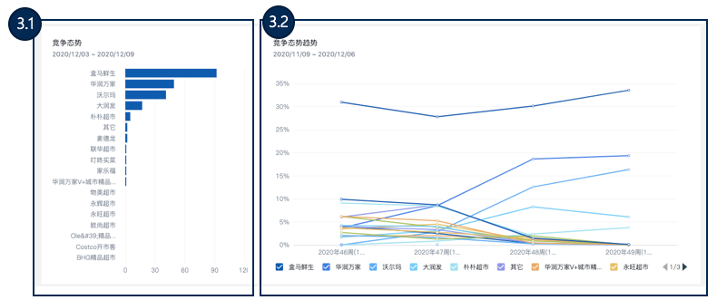

# 门店营运

## 分析思路

#### 一、门店营运概览，影响因子排行

查看山姆会员店NPS值及趋势，结合门店购物体验满意度和商品满意度的值和趋势，确定门店购物体验和商品对山姆会员店NPS影响的大小。门店购物体验满意度和商品满意度值越小，对NPS提升作用越小，即需改善点。例如：NPS=66.32，门店购物体验满意度为53.68，商品满意度为68.93，即门店购物体验需要优化。l通过购物体验各因素满意度对NPS影响排名和商品各因素满意度对NPS影响排名，分别找出对NPS影响最大的关键因素。排名按数值的从高到低排序，数值越低对NPS提升的帮助越小，即需改善因素。例如：在购物体验各因素满意度对NPS影响排名中，停车场体验为0.16，得分最低，即为最需改善点；l通过购物体验各因素对NPS环比影响表和商品各因素NPS环比影响表，分别找出对NPS环比影响最大的关键因素。其中环比下降最多的即为对NPS环比影响最大的，即需改善因素。例如：NPS环比下降3.59%，其中停车场体验环比下降4.89%，在各因素中下降最多，即为最需改善点；

#### 二、会员反馈，洞察问题根因

了解会员对门店购物旅程的总体反馈，洞察会员关注要点以及会员对门店服务的抱怨点，形成优化重点；l收集不满意员工服务的客户反馈，通过语义分析智能形成客户反馈的主要观点。这些观点可以作为优化员工服务的主要抓手，可结合反馈详情查看客户反馈的具体内容。  

#### 三、竞争态势

会员对竞品使用的排行及趋势，

## 一、门店营运概览

了解山姆会员店总NPS、门店购物体验满意度、商品满意度（门店）概览及趋势变化，对门店营运中的各个二三级指标进行对比

1.1、会员店NPS推荐可能性、门店营运总体满意度、商品整体满意度的指标值及趋势；

1.2、会员关于NPS分值反馈分析：会员观点汇总及反馈详情

1.3、门店营运中的各个三级指标对NPS影响值及满意度对比排行

## 二、会员反馈，洞察问题根因

结合智能提取的会员反馈中的主要观点，找出门店营运中的关键问题触点并加以改善

2.1、会员关于门店营运反馈分析：会员观点汇总及反馈详情

2.2、会员关于员工服务不满意度反馈分析：会员观点汇总及反馈详情

## 三、竞争态势

会员对竞品使用的排行及趋势

3.1、竞争态势汇总排行，

3.2、竞争态势趋势排行情况，

